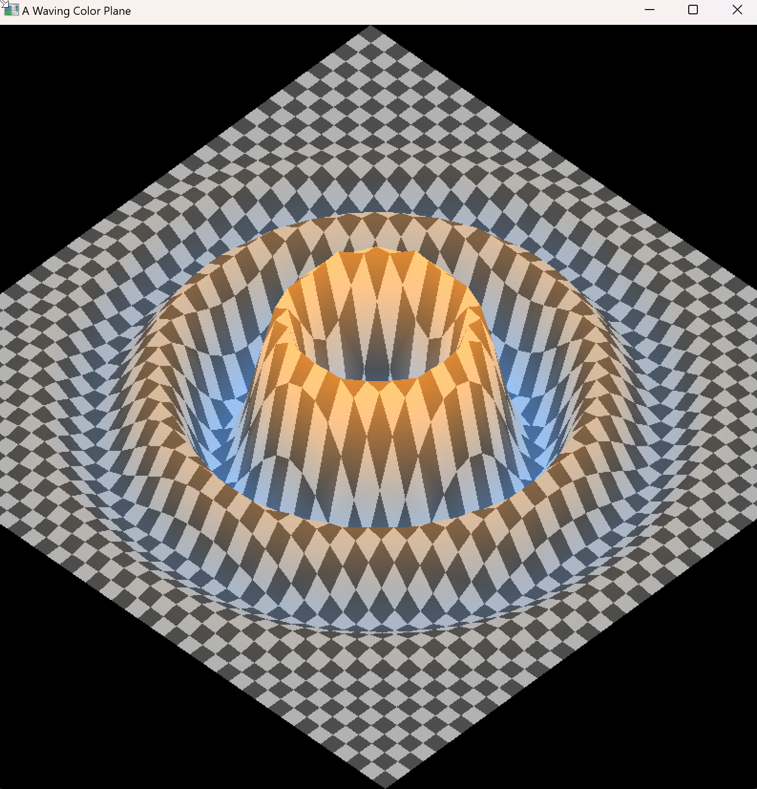
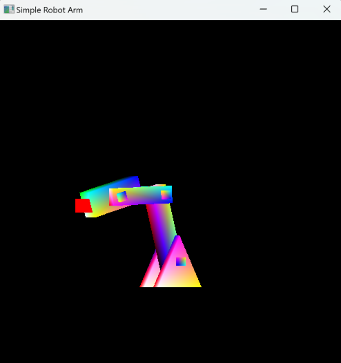
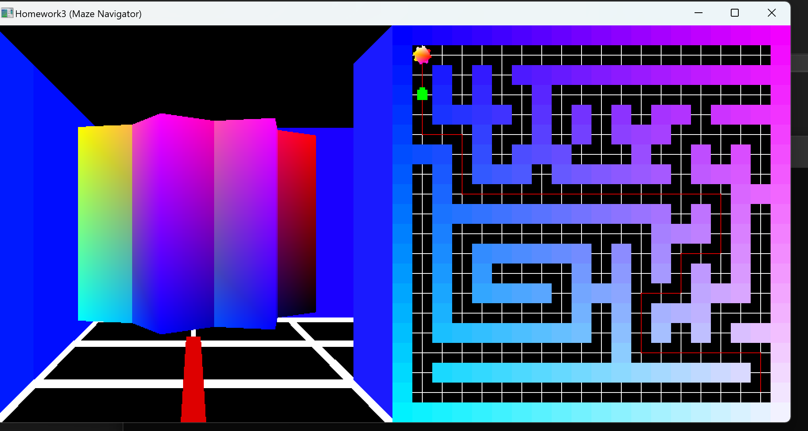
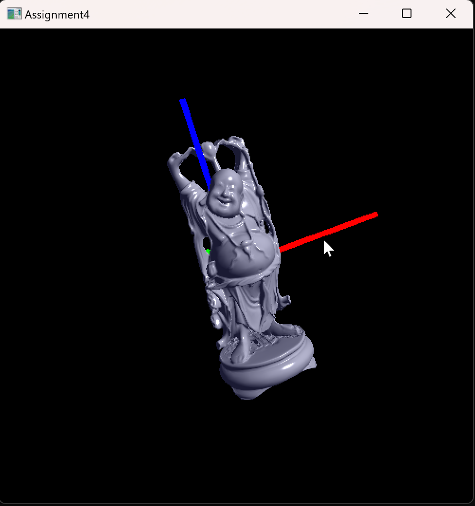
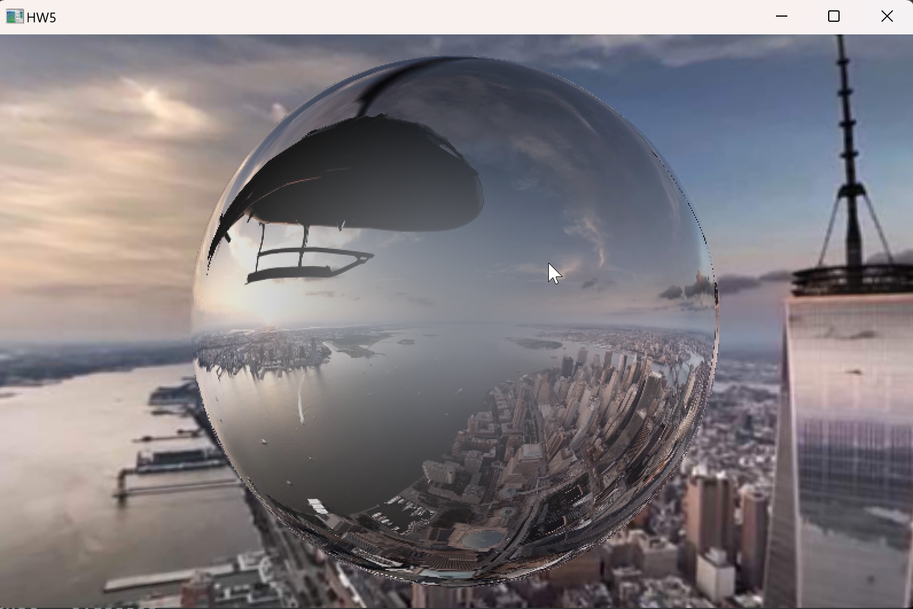
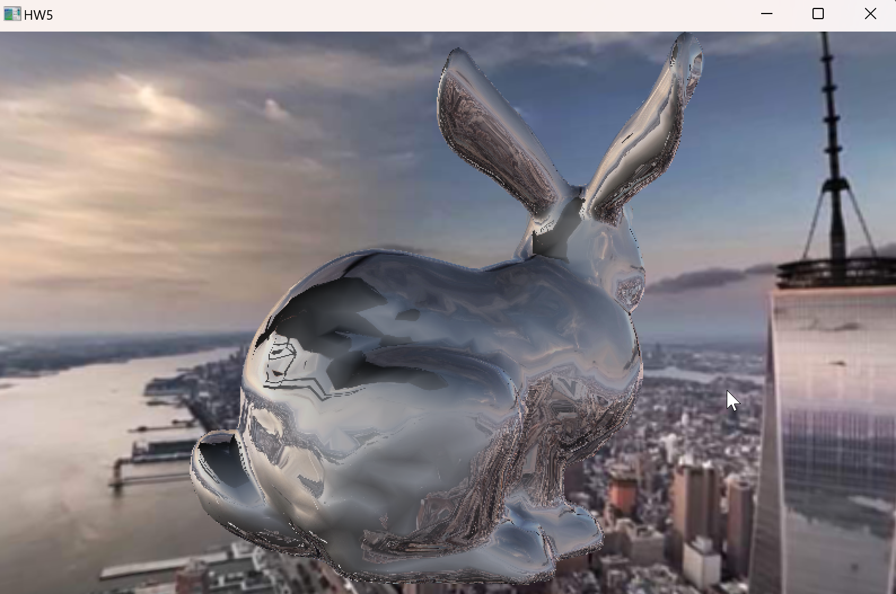

# OpenGL Things
OpenGL Projects using GLEW and freeGLUT
## Wave

Implemented a damped sine wave animation centered on the plane using a vertex shader.

KEY

1 : Decreasing the number of Division

2 : Increasing the number of Division

w : Showing/hiding the waving pattern

Spacebar : Starting/stoping rotating and waving

q : Exit the program

## Robot Arm

Built a visually enhanced robot arm using CTM(Current Transformation Matrix) and implemented Inverse Kinematics with Cyclic Coordinate Descent (CCD) to follow a moving target.

KEY 

1 : Toggle Between Chasing the target or not

2 : Toggle Between Showing the target position or not

3 : Toggle Between Randomly Positioning the target or not

Spacebar : start/stop Playing

## Maze

Implemented a maze navigation system using the A* algorithm, where the camera rotates and handles collisions to follow the path, and the right-side minimap is rendered using orthogonal projection.

KEY

W, A, S, D : Move

q : Show the shortest path

Spacebar : Follow the shortest path shown

## Shading

Parsed an OBJ file to load vertex and face data, applied normalization and centering, implemented both Phong and Flat Shading with selectable normal modes, and made Specular effects and Shininess adjustable.

KEY

Left Mouse Button : rotating around x-axis

Middle Mouse Button : rotating around y-axis

Right Mouse Button : rotating around z-axis

1 : Using Vertex Normal for shading

2 : Using Surface Normal for shading

3 : Increasing Specular effect (ks)

4 : Decreasing Specular effect (ks)

5 : Increasing Shininess (n)

6 : Decreasing Shininess (n)

q : Exit the program

## Spherical Map

Mapped a 360° image onto a sphere with horizontal flip, implemented trackball-style camera control, and applied Fresnel effect with reflection-based diffuse light mapping for realistic shading.

